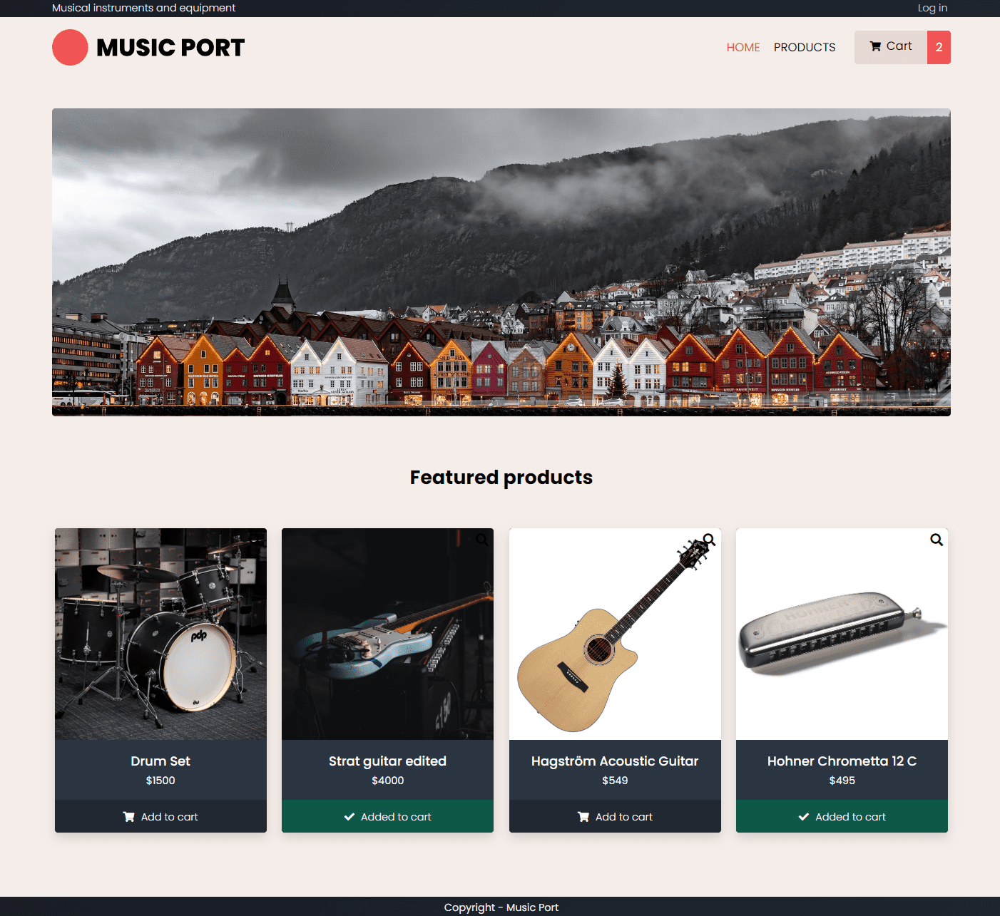

<div id="top"></div>

<!-- PROJECT LOGO -->
<br />
<div align="center">

  

  <h3 align="center">Music Port // Semester Project 2</h3>

  <p align="center">
    An ecommerce website with product grids, search, detail pages, cart functionality, login and editing capabilities.
    <br />
    <br />
    <a href="https://wangen-sp2.netlify.app/">View live website</a>
    ·
    <a href="https://github.com/oysteinwangen/oystein-wangen-semester-project-2/issues">Report Bug</a>
    ·
    <a href="https://github.com/oysteinwangen/oystein-wangen-semester-project-2/issues">Request Feature</a>
  </p>
</div>


<!-- TABLE OF CONTENTS -->
<details>
  <summary>Table of Contents</summary>
  <ol>
    <li>
      <a href="#about-the-project">About The Project</a>
      <ul>
        <li><a href="#built-with">Built With</a></li>
      </ul>
    </li>
    <li>
      <a href="#getting-started">Getting Started</a>
      <ul>
        <li><a href="#prerequisites">Prerequisites</a></li>
        <li><a href="#installation">Installation</a></li>
      </ul>
    </li>
    <li><a href="#usage">Usage</a></li>
    <li><a href="#roadmap">Roadmap</a></li>
    <li><a href="#contributing">Contributing</a></li>
    <li><a href="#license">License</a></li>
    <li><a href="#contact">Contact</a></li>
    <li><a href="#acknowledgments">Acknowledgments</a></li>
  </ol>
</details>


<!-- DESCRIPTION -->
## Description



Music Port is a website with ecommerce functionalities for selling musical instruments and gear. The framework can be connected to any REST API/Headless CMS, giving you the possibility to use it for any kind of ecommerce business.

**The website has the following features for the end user:**
* Home page with a header image and a products grid containing only featured products
* Products page containing all products
* Details page for single products
* "Add to cart"-buttons on product grids and details pages
* A cart page pulling in all products added to cart from localStorage

**Features for the admin user:**
* Login
* Edit products
* Add products

### Built With
* Vanilla javascript
* [SASS](https://sass-lang.com/)
* HTML

*The **backend** was built using the Strapi Headless CMS, and connected using REST API. [Here's the repo link to that, if you're interested.](https://github.com/oysteinwangen/strapi-sp2-ow)*

<p align="right">(<a href="#top">back to top</a>)</p>


<!-- GETTING STARTED -->
## Getting Started

### Prerequisites

**Recommendations**
* Use a code editor you are comfortable with. I recommend [Visual Studio Code](https://code.visualstudio.com/).
* I recommend using the "Live Server" VS Code extension by Ritwick Dey, for fast and continuous development with live preview.

**SASS Compilation**

Since this project utilises SASS, you'll need a SASS compiler. I recommend the "Live Sass Compiler" VS Code extension by Ritwick Dey.

The compiled `.css` should go into the `./css`-folder. If your using the aforementioned extension by configuring the `settings.json` for the extension as follows:
```js
  "liveSassCompile.settings.formats": [
  
    {
      "format": "expanded",
      "extensionName": ".css",
      "savePath": "~/../css/"
    }
  ]
```

### Installation

Clone the repo:
   ```sh
   git clone git@github.com:oysteinwangen/oystein-wangen-semester-project-2.git
   ```

<p align="right">(<a href="#top">back to top</a>)</p>

<!-- USAGE -->
## Usage

The project's UI is based on basic HTML, javascript, custom css properties and utility classes. All functionality and API requests are coded in javascript.

### Typography

All typography is built using custom properties and utility classes in css. The utlity classes er made with responsiveness and consistent UX in mind, and must therefore be utilised.

Example:
```html
<p class="fs-300 fw-300">Musical instruments and equipment</p>
```
`fs` = font size

`fw` = font weight

The class `.page-title` will align to center.

For a full overview of all properties and utlity classes, [look in the .scss file](https://github.com/oysteinwangen/oystein-wangen-semester-project-2/blob/main/scss/main/_typography.scss).

### Layout

Use the `.container` or `.mini-container` class for all content that should fit within the general document flow.

Classes for top margin and shadows are also available. [View the `.scss` file for a full overview](https://github.com/oysteinwangen/oystein-wangen-semester-project-2/blob/main/scss/main/_layout.scss).


<p align="right">(<a href="#top">back to top</a>)</p>

### Colors

All colors used are based on custom properties.

You can easily customize the colors in `./scss/main/_color.scss` to make it fit your own color scheme.

```css
:root {
  --clr-primary-600: #30475e; /* LIGHT PRIMARY */
  --clr-primary-700: #2b3542;
  --clr-primary-800: #222831; /* DARK PRIMARY */
  --clr-primary-900: #161b22;

  --clr-accent-400: #f05454; /* MAIN BRAND COLOR */
  --clr-accent-500: #d34242;

  --clr-bg-200: #f5ede9; /* MAIN LIGHT */
  --clr-bg-300: #e6d9d3;

  --clr-neutral-100: #fff;
  --clr-neutral-200: #f1f1f1;
  --clr-neutral-700: #333;
  --clr-neutral-900: #000;
}
```

### Custom API

To use your own API, go to `./js/settings/api.js` and change the base url. Endpoints and meta keys will have to be changed in individual javascript files if not the same.

```js
export const baseUrl = "https://strapi-sp2-ow.herokuapp.com/";
export const productsUrl = "products/";
export const homeUrl = "home/";
```

<!-- CONTRIBUTING -->
## Contributing

Contributions are what make the open source community such an amazing place to learn, inspire, and create. Any contributions you make are **greatly appreciated**.

If you have a suggestion that would make this better, please fork the repo and create a pull request. You can also simply open an issue with the tag "enhancement".
Don't forget to give the project a star! Thanks again!

1. Fork the Project
2. Create your Feature Branch (`git checkout -b feature/AmazingFeature`)
3. Commit your Changes (`git commit -m 'Add some AmazingFeature'`)
4. Push to the Branch (`git push origin feature/AmazingFeature`)
5. Open a Pull Request

<p align="right">(<a href="#top">back to top</a>)</p>


<!-- LICENSE -->
## License

Distributed under the MIT License. See `LICENSE.txt` for more information.

<p align="right">(<a href="#top">back to top</a>)</p>


<!-- CONTACT -->
## Contact

Your Name - [@your_twitter](https://twitter.com/your_username) - email@example.com

Project Link: [https://github.com/your_username/repo_name](https://github.com/your_username/repo_name)

<p align="right">(<a href="#top">back to top</a>)</p>


<!-- ACKNOWLEDGMENTS -->
## Acknowledgments

Use this space to list resources you find helpful and would like to give credit to. I've included a few of my favorites to kick things off!

* [Choose an Open Source License](https://choosealicense.com)
* [GitHub Emoji Cheat Sheet](https://www.webpagefx.com/tools/emoji-cheat-sheet)
* [Malven's Flexbox Cheatsheet](https://flexbox.malven.co/)
* [Malven's Grid Cheatsheet](https://grid.malven.co/)
* [Img Shields](https://shields.io)
* [GitHub Pages](https://pages.github.com)
* [Font Awesome](https://fontawesome.com)
* [React Icons](https://react-icons.github.io/react-icons/search)

<p align="right">(<a href="#top">back to top</a>)</p>


<!-- MARKDOWN LINKS & IMAGES -->
<!-- https://www.markdownguide.org/basic-syntax/#reference-style-links -->
[contributors-shield]: https://img.shields.io/github/contributors/othneildrew/Best-README-Template.svg?style=for-the-badge
[contributors-url]: https://github.com/othneildrew/Best-README-Template/graphs/contributors
[forks-shield]: https://img.shields.io/github/forks/othneildrew/Best-README-Template.svg?style=for-the-badge
[forks-url]: https://github.com/othneildrew/Best-README-Template/network/members
[stars-shield]: https://img.shields.io/github/stars/othneildrew/Best-README-Template.svg?style=for-the-badge
[stars-url]: https://github.com/othneildrew/Best-README-Template/stargazers
[issues-shield]: https://img.shields.io/github/issues/othneildrew/Best-README-Template.svg?style=for-the-badge
[issues-url]: https://github.com/othneildrew/Best-README-Template/issues
[license-shield]: https://img.shields.io/github/license/othneildrew/Best-README-Template.svg?style=for-the-badge
[license-url]: https://github.com/othneildrew/Best-README-Template/blob/master/LICENSE.txt
[linkedin-shield]: https://img.shields.io/badge/-LinkedIn-black.svg?style=for-the-badge&logo=linkedin&colorB=555
[linkedin-url]: https://linkedin.com/in/othneildrew
[product-screenshot]: images/screenshot.png
